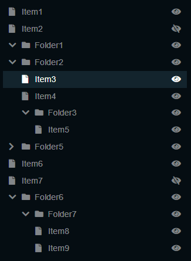

# sl-vue-tree

Customizable draggable tree component for Vue.js



[demo](https://holiber.github.io/sl-vue-tree/demo/index)

install

`npm i sl-vue-tree`


	
# Quick start

In your HTML, insert an `sl-vue-tree` element.

````html

<div id="app">
  <sl-vue-tree v-model="nodes" ref="myExampleSlVueTree">
	<!-- inside here, add TEMPLATE tags if you want to specify how sl-vue-tree 
             should display: 
                 (a) the expand/collapse marker, 
                 (b) the title of the node, 
                 (c) any additional sidebar text for that node
		 (d) any other data you wish to store within the node, in the node.data property	
         -->
  </sl-vue-tree>
</div>

<link rel="stylesheet" href="dist/sl-vue-tree-dark.css">
<script src="dist/sl-vue-tree.js"></script>

<script>

  // Each tree you want to display needs a Javascript array, containing its nodes (here in the variable "nodes") 
  // and a corresponding SlVueTree object (here called "myExampleSlVueTree", which you can access in 
  // the `methods` as `this.$refs.myExampleSlVueTree`). 
  // You can manipulate the tree by manipulating `nodes` in Javascript, or (if you prefer to reference the target node
  // by its path, such as `[2,3,10]` for the 11th child of the 4th child of the 3rd item in the root of the tree),
  // you can use the `updateNode` method. 
  // For example, to to set a "prizeWinner" property 
  //	 this.$refs.myExampleSlVueTree.updateNode([2,3,10],{data:{prizeWinner:true}})
 
var nodes = [ 
	// "nodes" is the tree. It consists of multiple individual nodes. 
	// If there are children then include the "children" property too, 
	// which is a tree itself (and so on, to whatever depth you need.) 
	
    {title: 'Item1', isLeaf: true},
    {title: 'Item2', isLeaf: true, data: { visible: false }},
    {title: 'Folder1'},
    {
      title: 'Folder2', isExpanded: true, children: [
        {title: 'Item3', isLeaf: true},
        {title: 'Item4', isLeaf: true}
      ]
    }
  ];

  new Vue({
    el: '#app',
    components: { SlVueTree },
    data: function () {
     return {
       nodes: nodes
     }
    }
  });
  
</script>    

````

The `value` property is an array of `ISlTreeNodeModel` nodes:

````typescript
interface ISlTreeNodeModel<TDataType> {
    title: string;
    isLeaf?: boolean;
    children?: ISlTreeNodeModel<TDataType>[];
    isExpanded?: boolean;
    isSelected?: boolean;
    isDraggable?: boolean;
    isSelectable?: boolean;
    data?: TDataType; // any serializable user data
}
````

For convenience the component's events return `ISlTreeNode` objects. Those actually are `ISlTreeNodeModel`
with some computed props:
````typescript
interface ISlTreeNode<TDataType> extends ISlTreeNodeModel<TDataType> {
    isFirstChild: boolean;
    isLastChild: boolean;
    isVisible: boolean;	// node is visible if all of its parents are expanded
    level: number; // nesting level
    ind: number; // index in the array of siblings 
    path: number[]; // path to node as array of indexes, for example [2, 0, 1] in the example above is path to `Item4` 
    pathStr: string; // serialized path to node
    children: ISlTreeNode<TDataType>[];
}
````

You can get the list of `ISlTreeNode` from the computed `slVueTree.nodes` property


# Props

| prop             | type               | default                | description                                                                                                                                                                                              |
|------------------|--------------------|------------------------|----------------------------------------------------------------------------------------------------------------------------------------------------------------------------------------------------------|
| value            | ISlTreeNodeModel[] | []                     | An array of nodes to show. Each node is represented by `ISlTreeNodeModel` interface                                                                                                                              |
| allowMultiselect | Boolean            | true                   | Disable or enable the multiselect feature                                                                                                                                                                |
| edgeSize         | Number             | 3                      | Offset in pixels from top and bottom for folder-node element. While dragging cursor is in that offset, the dragging node will be placed before or after the folder-node instead of being placed inside the folder. |
| scrollAreaHeight | Number             | 70                     | Offset in pixels from top and bottom for the component element. While dragging cursor is in that area, the scrolling starts.                                                                                |
| maxScrollSpeed   | Number             | 20                     | The scroll speed is relative to the cursor position. Defines the max scroll speed.             
| multiselectKey   | String/String[] |['ctrlKey', 'metaKey'] | The keys for multiselect mode. Allowed values are ['ctrlKey', 'metaKey', 'altKey']   

# Computed props

| prop           | type            | description                                                                                                                                                                                                                                                     |
|----------------|-----------------|-----------------------------------------------------------------------------------------------------------------------------------------------------------------------------------------------------------------------------------------------------------------|
| nodes          | ISlTreeNode[]   | List of nodes with some computed props. See `ISlTreeNode` interface.                                                                                                                                                                                            |
| cursorPosition | ICursorPosition | Represents the current cursor position that describes the action that will be applied to the dragged node on `mouseup` event. See `ICursorPosition` interface |
| selectionSize  | Number          | The count of selected nodes
| dragSize       | Number          | The count of selected and draggable nodes
| isDragging     | Boolean         | True if nodes are dragging

````
interface ICursorPosition<TDataType> {
  node: ISlTreeNode<TDataType>;
  placement: 'before' | 'inside' | 'after';
}  
````

# Events

| event           | callback arguments                                                         | description                                       |
|-----------------|----------------------------------------------------------------------------|---------------------------------------------------|
| input           | nodes: ISlTreeNodeModel[]                                                  | triggers for any changes to `value` property     |
| select          | selectedNodes: ISlTreeNode[], event: MouseEvent                            | triggers when a node has been selected/deselected |
| toggle          | toggledNode: ISlTreeNode, event: MouseEvent                                | triggers when a node has been collapsed/expanded  |
| drop            | draggingNodes: ISlTreeNode[], position: ICursorPosition, event: MouseEvent | triggers when dragging nodes have been dropped    |
| nodeclick       | node: ISlTreeNode, event: MouseEvent                                       | handle `click` event on node                      |
| nodedblclick    | node: ISlTreeNode, event: MouseEvent                                       | handle `dblclick` event on node                   |
| nodecontextmenu | node: ISlTreeNode, event: MouseEvent                                       | handle `contextmenu` event on node                |

# Methods


| method                                                                                                   | description                                                                                        |
|----------------------------------------------------------------------------------------------------------|----------------------------------------------------------------------------------------------------|
| getNode(path: number[]): ISlTreeNode                                                                     | Find the node by using its path                                                                   |
| traverse(cb: (node: ISlTreeNode, nodeModel: ISlTreeNodeModel, siblings: ISlTreeNodeModel[])  => boolean) | Helpful method to traverse all nodes. The traversing will be stopped if callback returns `false`.  |
| updateNode(path: number[], patch: Partial<ISlTreeNodeModel>)                                             | Update the node by using its path                                                                 |
| select(path: number[], addToSelection = false)                                                           | Select the node by using its path                                                                 |                                                                                                                                              |
| getNodeEl(): HTMLElement                                                                                 | Get the node HTMLElement by using its path                                                        |
| getSelected(): ISlTreeNode[]                                                                             | Get selected nodes                                                                                 |
| remove(paths: number[][])                                                                                | Remove nodes by paths. For example `.remove([[0,1], [0,2]])`
| getFirstNode(): ISlTreeNode                                                                              | Get the first node in the tree                                                                     |
| getLastNode(): ISlTreeNode                                                                               | Get the last node in the tree
| getNextNode(path: number[], filter?: (node: ISlTreeNode<TDataType>) => boolean): ISlTreeNode<TDataType>; | Get the next node. You can skip the next nodes by using `filter`
| getPrevNode(path: number[], filter?: (node: ISlTreeNode<TDataType>) => boolean): ISlTreeNode<TDataType>; | Get the previous node. You can skip the previous nodes by using `filter`

# Slots


| slot       | context     | description                                                                                   |
|------------|-------------|-----------------------------------------------------------------------------------------------|
| title      | ISlTreeNode | Slot for item title                                                                           |
| toggle     | ISlTreeNode | Slot for expand/collapse button                                                               |
| sidebar    | ISlTreeNode | Sidebar content                                                                               |
| draginfo   | SlVueTree   | Slot that follows the mouse cursor while dragging. By default shows the dragging nodes count. |
| empty-node | ISlTreeNode | Slot for (optional) message when folder is open, but empty                                    |

# IE 11 support

You must add a [babel-polyfill](https://babeljs.io/docs/en/babel-polyfill) for it to work correctly in IE11  
[See IE11 example](https://holiber.github.io/sl-vue-tree/demo/ie11test.html)


# Examples


## Customising tree display using the `slot` attribute

If you don't put anything between the opening and closing `sl-vue-tree` tags, SlVueTree will display the tree in its default format. To customise this, simply provide a template for how to display each aspect of the nodes of the tree. The aspects are listed in the `Slots` table above. For example, if you want to add folder and item icons, the best way is to intercept the place where the `title` would normally be displayed, and modify that to display first the icon and then the name. 

To do this, create an inner `template` element. Because it will take the place of the default display of the title, set its `slot` attribute to be `"title"`. You want your customized title display to have access to the individualised text of the node's title (so that it can embelish it) so you need to receive a copy of the node in the template. Do that by setting the `slot-scope` attribute to `{ node }`. Then within the template element, you can access any property or computed property of the node. 

In the example below, we are reading the `.isLeaf` property of the node, which tells us whether the node is a leaf (like a file in a disk, i.e. has no children) or a non-leaf (like a folder in a disk, i.e. is the place files are kept). We use v-if so that depending on whether the node is a leaf or not, we display either the file or folder icon, in this case from Font Awesome.

Then we read the `.title` property of the node so we can display it.

````html
<sl-vue-tree v-model="nodes">

   <template slot="title" slot-scope="{ node }">
      <span class="item-icon">
        <i class="fa fa-file" v-if="node.isLeaf"></i>
        <i class="fa fa-folder" v-if="!node.isLeaf"></i>
      </span>
      {{ node.title }}
    </template>

</sl-vue-tree>

````

You may also wish to customise the `toggle` slot, which defaults to being a "plus" or "minus" sign, indicating at each non-leaf node whether you can expand or collapse the subtree that begins at that node.

## Programmatically manipulating the tree

Suppose you have defined a tree as follows:

 <sl-vue-tree v-model="nodes" ref="myExampleSlVueTree">
 </sl-vue-tree>

And suppose you want to change the title of the second node at the root level of the tree. Indexing is zero-based, so the index of the node is 1.


```javascript
this.$refs.myExampleSlVueTree.updateNode([1],{title,'Much More Impressive Title'})
```

Using the SlVueTreeObject `this.$refs.myExampleSlVueTree` guarantees it will all be done correctly and the component will update on screen. If you manipulate the tree directly in Javascript, it is advisable to use `Vue.set`, which works behind the scenes to ensure the display gets updated. Here is an example showing how to traverse a tree, marking every node as selected.

The `traverse` method takes a function as a parameter and calls-back this function for each node in the tree. 

```javascript
this.$refs.myExampleSlVueTree.traverse((node, nodeModel, siblings) => {
    Vue.set(nodeModel, 'isSelected', true);
})
```

## Responding to user interactions with the tree component

If, for example, you want to respond to a right-click or long-press, by doing something special, you can specify a handler (and use `event.preventDefault` to prevent the system default action from taking place).

 ````html
<sl-vue-tree v-model="nodes" ref="myExampleSlVueTree" @nodecontextmenu="myFancyFunctionForHandling">
 </sl-vue-tree>
```` 
 
````javascript
methods: {

	myFancyFunctionForHandling:function(nodes,event){
		console.log("Event:", event)
		console.log("Nodes:", nodes)
		console.log("Now do various clever stuff ...")
		event.preventDefault() // This stops the browser's default handling i.e. showing the right-click menu  
	}
}
````
 

## Handle keydown and keyup events via `getNextNode` and `getPrevNode` methods

[demo](https://holiber.github.io/sl-vue-tree/demo/keyboardcontrol)

## Contributing
[see CONTRIBUTING.md](CONTRIBUTING.md)

# Changelog

v1.8.1
- added IE11 support https://github.com/holiber/sl-vue-tree/issues/17

v1.8.0

- added `empty-node` slot

v1.7.1

- added `multiselectKey` property

v1.7.0

- added `isSelectable` and `isDraggable` flags

v1.6.0

- added `getNextNode` and `getPrevNode` methods https://github.com/holiber/sl-vue-tree/issues/6

v1.5.1
- improve drop on the bottom of tree https://github.com/holiber/sl-vue-tree/issues/5

v1.5.0
- `SlVueTree.select` method added
- `SlVueTree.@nodeclick` event fixed
